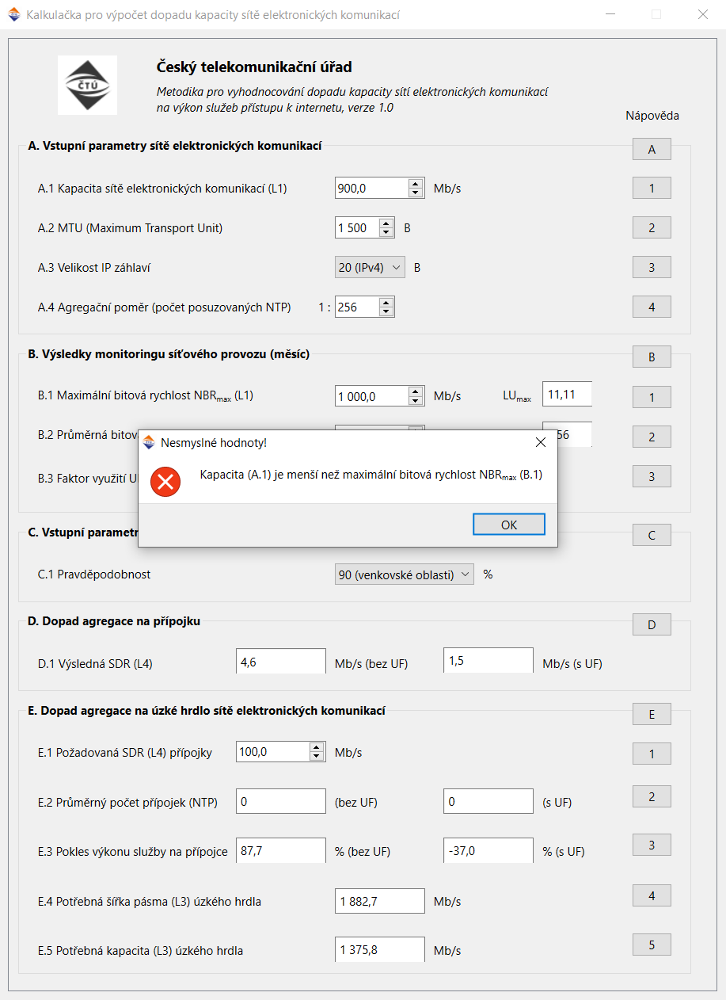

# Kalkulačka pro výpočet dopadu kapacity sítě elektronických komunikací

Pomocný nástroj k vysvětlení problematiky vyhodnocování dopadu kapacity sítí elektronických komunikací v rámci metodického postupu Českého telekomunikačního úřadu "Metodika pro vyhodnocování dopadu kapacity sítí elektronických komunikací na výkon služeb přístupu k internetu"

## Zdrojový kód, použití, spuštění

V prostředí Pythonu s nainstalovanými knihovnami (`requirements.txt`) lze aplikaci spustit přímo přes hlavní skript (`app.py`).

Aplikaci lze vytvořit jako spustitelnou/distribuovatelnou bez nutnosti nastavovat prostředí Pythonu a příslušných knihoven např. pomocí knihovny `pyinstaller` a vhodné konfigurace (soubory `*.spec`). Příkaz `pyinstaller build-onefile.spec` sestaví aplikaci do formy jednoho spustitelného souboru (pro operační systém, na kterém je sestavení spuštěno).

Více informací o možnostech distribuce např. zde: [https://docs.python-guide.org/shipping/freezing/](https://docs.python-guide.org/shipping/freezing/)

## Fungování

Aplikace při vkládání/změně vstupních hodnot ihned přepočítává výstupní hodnoty a v případě, že dojde k nějakému nesouladu, upozorňuje uživatele na problém.

